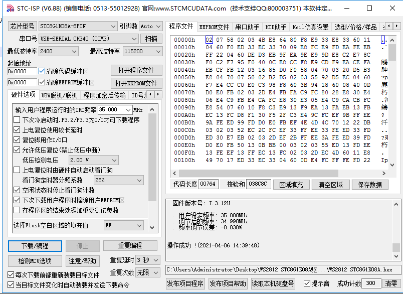

# WS2812 One-Button Controller for STC8G1K08A

[](LICENSE)
[中文文档 / Chinese README](README.zh-CN.md)

Firmware for a minimal, one-button WS2812 / NeoPixel LED-strip controller built
on the **STC8G1K08A** — an 8-pin, 1T-8051 microcontroller that costs about
**US $0.27**. No crystal, no timers, no SPI/PWM peripherals: the 800 kHz
single-wire WS2812 protocol is bit-banged with cycle-counted code on the chip's
internal 35 MHz RC oscillator.

Interestingly, a true *single-button* addressable-LED controller barely exists
as a commercial product (the market minimum is 3 buttons, e.g. the SP002E
class) — which makes this tiny design genuinely useful.

## Features

- **One-button interface**
  - **Short press** — cycle through 7 colors: red → green → blue → magenta →
    yellow → cyan → white (fires on release, so it never conflicts with a
    long press).
  - **Long press** (≥ 500 ms) — brightness ramps up smoothly while held; past
    maximum it wraps back to minimum. Release to stop at the current level.
- **Settings memory** — color and brightness are saved to the on-chip
  EEPROM (IAP) when the button is released and restored at power-up. A magic
  byte validates the data; writes happen only on key release to minimize
  flash wear.
- **Uniform brightness model** — colors are stored as R/G/B on-off flags and
  every lit channel uses the same 8-bit brightness value, so perceived
  brightness is consistent across colors. A floor (`MIN_BRIGHT = 8`) keeps
  the strip from ever looking dead; a ceiling (`MAX_BRIGHT`) can cap current
  draw.
- **Robust key handling** — 3 × 5 ms debounce, clean short/long-press
  discrimination, ramp step every 15 ms while held.
- **Drives 50 LEDs by default** (`LedNum`, easily changed) in GRB order.
- **Two toolchains, same behavior**
  - Keil C51 (µVision project included) — the original build.
  - SDCC (free, open source; macOS/Linux/Windows) — `firmware/sdcc/build.sh`.
    The SDCC build is **reproducible**: rebuilding from this repo produces a
    hex byte-identical to the shipped one.
- **Tiny** — SDCC build: 968 bytes of flash (of 8 KB), 150 bytes XRAM.
  Keil build: ~1.9 KB (it additionally links a float HSV→RGB helper, kept as
  an extension hook for rainbow/gradient effects).
- **Prebuilt hex files** in [prebuilt/](prebuilt/) — flash and go, no
  toolchain needed.

## Hardware

| Pin (SOP8) | Signal | Function |
|-----------|--------|----------|
| P3.2 | KEY | Push button to GND (active low, internal weak pull-up — no external resistor needed) |
| P3.3 | DIN | WS2812 data in |
| P3.0 / P3.1 | RxD / TxD | UART, used only for flashing via a CH340-class USB-serial adapter |
| VCC / GND | Power | 5 V |

```
        5V ──────────────┬──────────────────────┐
                         │                      │
                   ┌─────┴─────┐    ~300Ω   ┌───┴────────┐
        KEY ──┐    │ STC8G1K08A│ P3.3 ─/\/\─┤ DIN  WS2812│ ⇒⇒⇒ (50 LEDs)
      (to GND)└────┤ P3.2      │            │      strip │
                   └─────┬─────┘            └───┬────────┘
                         │                      │
        GND ─────────────┴──────────────────────┘
```

**Power notes**

- Run the MCU at 5 V so its logic-high meets the WS2812's data threshold.
- 50 LEDs at full white / full brightness can draw ~3 A — feed the strip
  directly from the supply, not through the MCU board traces. The default
  brightness (26/255 ≈ 10%) keeps current modest.
- Standard WS2812 practice applies: a ~300 Ω series resistor in the data line
  and a large electrolytic capacitor (≥ 470 µF) across the strip supply are
  cheap insurance.

## How it works — the timing problem

A WS2812 encodes each bit in the **width of a high pulse** on a single wire at
800 kbps: roughly 220–380 ns high for a `0`, 580–1000 ns high for a `1`, with a
1.25 µs total bit period and a > 50 µs low "reset" to latch. There is no
peripheral on an 8051 that can generate this, and at the classic 11.0592 MHz
even one instruction is too coarse.

This firmware solves it the brute-force-but-reliable way:

1. **Overclock the internal RC oscillator to 35 MHz** (a supported,
   factory-trimmed setting on the STC8G — selected in the STC-ISP flashing
   tool, *not* in code). At 1 clock per machine cycle that is **28.6 ns of
   timing resolution**, enough to place edges anywhere in the WS2812 windows.
2. **Bit-bang with cycle-counted code** and interrupts disabled (`EA = 0`)
   during the whole frame, so nothing can stretch a pulse. The SDCC build does
   this in inline assembly with deterministic timing:

   | Symbol | Target | Achieved (35 MHz) | WS2812B window |
   |--------|--------|-------------------|----------------|
   | T0H | ~340 ns | 12 clk ≈ 343 ns | 220–380 ns |
   | T1H | ~690 ns | 24 clk ≈ 686 ns | 580–1000 ns |
   | T0L | ~830 ns | 29 clk ≈ 829 ns | 580–1600 ns |
   | T1L | ~490 ns | 17 clk ≈ 486 ns | 220–420 ns* |

   *Datasheet families differ on T1L minimums; both builds sit comfortably in
   the tolerant middle of every WS2812B variant we've tested.

   The trick worth stealing: each bit's MSB is pre-shifted into the carry flag
   (`rlc a`) **before** the pin goes high, so the high phase contains nothing
   but `nop`s — pulse width is set purely by nop count and immune to compiler
   codegen.
3. A 50-LED refresh (150 bytes × 8 bits × 1.25 µs ≈ **1.5 ms**) runs with
   interrupts off; the 5 ms main-loop tick provides the > 50 µs reset gap for
   free.

**Consequences you must respect**

- The IRC frequency configured in STC-ISP **must be 35.000 MHz**. Any other
  value silently breaks every timing above.
- Do not edit the `nop` counts in `LedRefresh()` (both trees) or "optimize"
  that function.
- If you move the data pin, update both the `sbit`/`__sbit` definition **and**
  the port-mode registers (`P3M0`/`P3M1`) in `WS2812_Init()`.

## Repository layout

```
.
├── README.md               ← you are here
├── README.zh-CN.md         ← Chinese version
├── PUBLISHING.md           ← how this repo was organized + how to publish it
├── LICENSE                 ← MIT (see note about bundled vendor files)
├── docs/
│   └── images/stc-isp-settings.png   ← known-good STC-ISP flashing settings
├── firmware/
│   ├── keil/               ← original Keil C51 build
│   │   ├── project/        ← µVision project (WS2812_STC8G1K08A.uvproj) + STARTUP.A51
│   │   └── source/         ← C sources + STC8G.H register header
│   └── sdcc/               ← free-toolchain port (flat sources + build.sh)
└── prebuilt/               ← ready-to-flash hex files (35 MHz IRC required)
```

The two source trees are deliberately kept separate rather than merged behind
`#ifdef`s: `LedRefresh()` is timing-critical and hand-tuned per compiler
(counted `_nop_()`s under Keil, inline assembly under SDCC), and both trees
are verified working on hardware. Functional differences are listed
[below](#keil-vs-sdcc-builds).

## Building

### Option A — SDCC (free, cross-platform)

```sh
# macOS: brew install sdcc     Debian/Ubuntu: sudo apt install sdcc
cd firmware/sdcc
./build.sh                     # → WS2812_STC8G1K08A.hex
```

### Option B — Keil µVision (C51)

1. STC parts are not in Keil's device database. Open the STC-ISP tool →
   *Keil ICE Settings* tab (Keil仿真设置) → *Add STC MCU type to Keil* —
   point it at your Keil install directory once.
2. Open `firmware/keil/project/WS2812_STC8G1K08A.uvproj`, device
   "STC8G1K08 Series".
3. Build (F7). The hex lands in `firmware/keil/output/`.

### Option C — no toolchain

Flash a file from [prebuilt/](prebuilt/) directly:

- `ws2812_stc8g1k08a_sdcc_35mhz.hex` — SDCC build (push-pull data pin,
  recommended)
- `ws2812_stc8g1k08a_keil_35mhz.hex` — original Keil build

## Flashing

STC MCUs are programmed over plain UART through a factory bootloader; the only
hardware you need is a **USB-to-TTL serial adapter** (CH340-class, ~US $1).

1. Wire: adapter TXD → P3.0 (RxD), adapter RXD → P3.1 (TxD), GND → GND,
   5 V → VCC (target power comes from the adapter or is switched with it).
2. Run **STC-ISP** (free, Windows; official download:
   <https://www.stcmicro.com/rjxz.html>). On macOS/Linux, the open-source
   [`stcgal`](https://github.com/grigorig/stcgal) or
   [`stc8prog`](https://github.com/IOsetting/stc8prog) also support the STC8G.
3. Select MCU type **STC8G1K08A-8PIN**, your COM port, and the hex file.
4. **Set "IRC frequency" to 35.000 MHz.** This is not optional — the WS2812
   bit timing is derived from it. All other options can match the screenshot:
   
5. Click *Download/Program*, **then power-cycle the target board** — the STC
   bootloader only runs on a cold boot.

> Note: the settings screenshot enables "erase user EEPROM on next download",
> so flashing resets the saved color/brightness to defaults. Uncheck it if you
> want settings to survive re-flashing.

## Configuration

Everything tunable lives in the headers (edit the tree you build):

| Macro | File | Default | Meaning |
|-------|------|---------|---------|
| `LedNum` | `ws2812.h` | 50 | Number of LEDs. SDCC tree: also update the `#150` (= LedNum × 3) constant in `LedRefresh()`'s assembly. |
| `COLOR_NUM` / `color_tab[]` | `ws2812.h` / `ws2812.c` | 7 colors | The palette; keep both in sync. |
| `DEFAULT_BRIGHT` | `ws2812.h` | 26 (~10 %) | First-boot brightness. |
| `MIN_BRIGHT` / `MAX_BRIGHT` | `ws2812.h` | 8 / 255 | Ramp floor / ceiling (lower the ceiling to cap current). |
| `RAMP_STEP` | `ws2812.h` | 2 | Brightness increment per ramp step. |
| `DB_TICKS` | `key.h` | 3 (~15 ms) | Debounce window. |
| `LONG_TICKS` | `key.h` | 100 (~500 ms) | Long-press threshold. |
| `RAMP_INTERVAL` | `key.h` | 3 (~15 ms) | Ramp step period while held. |
| `EEPROM_ADDR` | `eeprom.h` | 0x0000 | Settings sector (512-byte erase granularity). |

## Keil vs SDCC builds

| | Keil tree | SDCC tree |
|---|---|---|
| `LedRefresh()` | counted `_nop_()`s in C | inline assembly, fully deterministic |
| P3.3 drive mode | quasi-bidirectional | **push-pull** (sharper edges, stronger drive) |
| HSV→RGB helpers | included (`HSVtoRGB`, `SetLedHSVColor`) — unused hooks for effects | omitted (keeps the build under 1 KB) |
| Flash used | ~1.9 KB | 968 B |

## Where to buy

Prices checked July 2026; treat as indicative.

**The MCU — STC8G1K08A**

- **LCSC (international)**: part
  [C915663](https://www.lcsc.com/product-detail/C915663.html)
  (STC8G1K08A-36I-SOP8) — ~US $0.27 @ 5 pcs, ~$0.14 @ 5000; DFN8 variant
  C915664. Best source for guaranteed-original parts; also available through
  JLCPCB assembly as an extended part.
- **China domestic**: 立创商城 (szlcsc.com, same part number) or STC's official
  Taobao direct store (linked from the
  [product page](https://www.stcmicro.com/stc/stc8g1k08a.html)) — roughly
  ¥1–2 each.
- **AliExpress / Amazon / eBay**: 5-piece packs ≈ US $1–2 per pack
  (AliExpress) or several dollars with fast shipping (Amazon/eBay). DIP8
  through-hole parts are mostly found here. Digi-Key/Mouser do not stock STC.

**The LEDs — WS2812B strips/modules**

- **BTF-LIGHTING** (the de-facto reference vendor):
  [btf-lighting.com](https://www.btf-lighting.com), their Amazon store
  (5 m / 60 LED/m IP30 ≈ US $20–25), or their AliExpress official store
  (≈ $1.2–2.8/m). Beware no-name sub-$1/m strips — counterfeit driver ICs are
  common.
- **China domestic**: Taobao/JD, search “WS2812B 幻彩灯带 5V” — ≈ ¥8–20/m for
  60 LED/m bare-board strip.
- **US/EU makers**: Adafruit NeoPixel (same LED family, premium price, great
  docs).

**Flashing tools**

- CH340 USB-serial module: ≈ US $1–2 (AliExpress) / ¥3–10 (Taobao) /
  ~$8–10 per 5-pack (Amazon HiLetgo).
- STC-ISP software: free, <https://www.stcmicro.com/rjxz.html>.
- Optional: STC-USB Link1D programmer/debugger ≈ US $6 (LCSC C5328703), or
  “STC auto-download” adapters (~$3–6) that automate the power-cycle.

**Total BOM for a working controller: well under US $2** (MCU + button +
resistor + cap) plus the strip.

**Comparable finished products** (if you just want to buy one): the SP002E
class 3-button inline controller (US $1–5), BTF SP621E family ($6–9), RF-remote
minis ($8–14), SP108E Wi-Fi ($13–18). None of them offer a true single-button
interface — that is this project's niche.

## Ideas for extension

- Rainbow / gradient / chase effects — the Keil tree already ships an unused
  `HSVtoRGB()` + `SetLedHSVColor()` for exactly this.
- Double-click for on/off, or a "ping-pong" brightness ramp (bounce at the
  top instead of wrapping — the original author left a note considering it).
- Gamma correction table for a more linear perceived ramp.
- Use P5.4/P5.5 (the remaining free pins) for a second button or a light
  sensor.

## License

[MIT](LICENSE). The bundled `STC8G.H` (STCmicro) and `STARTUP.A51` (Keil)
remain under their vendors' terms; see the note in the LICENSE file.
